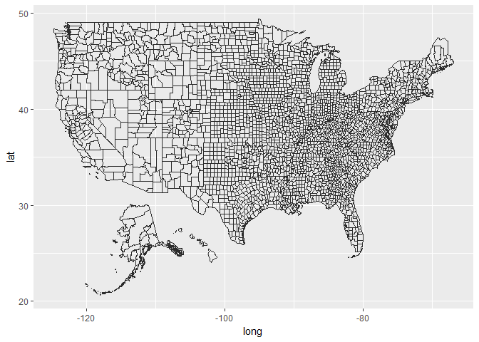
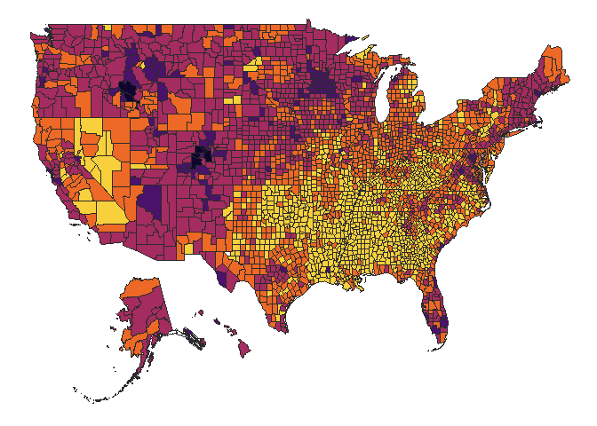
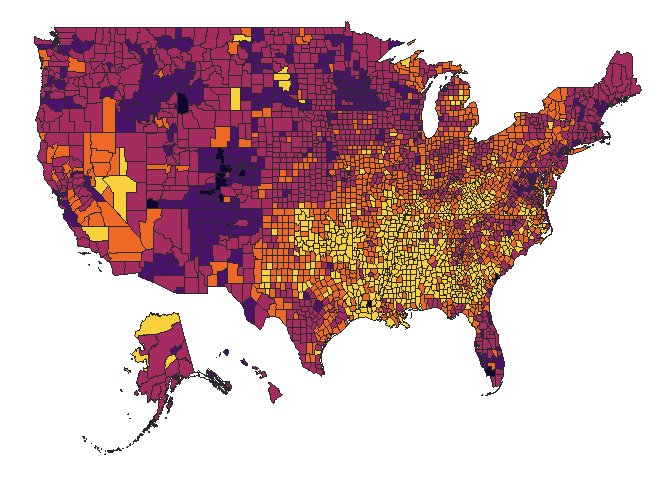
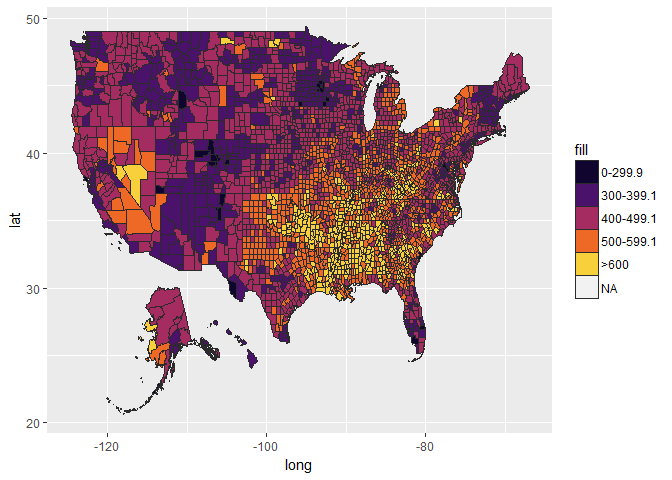
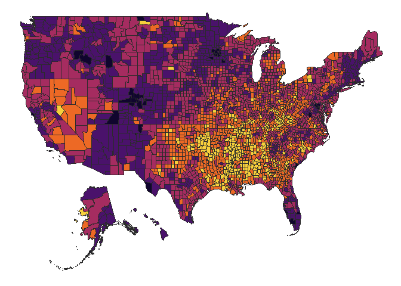
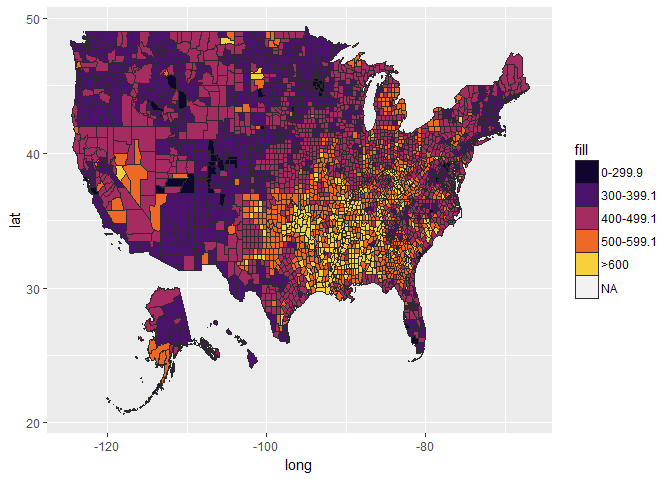

# Introduction

Heart disease is the leading cause of death in the USA, accounting for approximately 1 in every 4 deaths (@ref). **I will write more about introduction and include some figures in the next few days**.

## Prerequisites

To perform these maps, you will need to have several extra packages. I'm not going into how to install them, but a quick google search should tell you how to. The main libraries that we will need are:

1. [tidyverse](https://www.tidyverse.org/): this is a package created by Hadley Wickham. This "umbrella" package was designed to make data science analysis and visualition faster and easier. The main packages that we will use in this analysis are:
    + [dplyr](http://dplyr.tidyverse.org/): grammar of data manipulation, i.e. how to import, select, filter, and arrange your data for analysis;
    + [ggplot2](http://ggplot2.tidyverse.org/): system for declaratively creating graphics, i.e. you provide the data, tell it how to map, and it takes care of details;
    + [stringr](http://stringr.tidyverse.org/): provides a set of functions designed to make working with strings as easy as possible.
2. [maps](https://cran.r-project.org/web/packages/maps/README.html): package for displaying maps;
3. [mapdata](https://www.rdocumentation.org/packages/mapdata/versions/2.2-6): supplements the `maps` package, providing some larger and/or higher-resolution databases.
4. [ggmap](https://github.com/dkahle/ggmap): package to retrieve [raster map tiles](https://en.wikipedia.org/wiki/Tiled_web_map) (map displayed by joining dozens of individually requested image files over the internet) from popular online mapping service like Google Maps, and others.

## Load the libraries

```r
library(ggplot2)
library(maptools)
```

```
## Warning: package 'maptools' was built under R version 3.4.4
```

```
## Loading required package: sp
```

```
## Checking rgeos availability: TRUE
```

```r
library(ggalt)
```

```
## Warning: package 'ggalt' was built under R version 3.4.4
```

```r
library(ggthemes)
```

```
## Warning: package 'ggthemes' was built under R version 3.4.4
```

```r
library(albersusa) # devtools::install_github("hrbrmstr/albersusa")
library(rgeos)
```

```
## Warning: package 'rgeos' was built under R version 3.4.4
```

```
## rgeos version: 0.3-26, (SVN revision 560)
##  GEOS runtime version: 3.6.1-CAPI-1.10.1 r0 
##  Linking to sp version: 1.2-7 
##  Polygon checking: TRUE
```

```r
library(viridis)
```

```
## Warning: package 'viridis' was built under R version 3.4.4
```

```
## Loading required package: viridisLite
```

```
## Warning: package 'viridisLite' was built under R version 3.4.4
```

```r
library(scales)
```

```
## 
## Attaching package: 'scales'
```

```
## The following object is masked from 'package:viridis':
## 
##     viridis_pal
```

```r
library(tidyverse)
```

```
## -- Attaching packages -------- tidyverse 1.2.1 --
```

```
## v tibble  1.4.2     v purrr   0.2.4
## v tidyr   0.8.0     v dplyr   0.7.4
## v readr   1.1.1     v stringr 1.2.0
## v tibble  1.4.2     v forcats 0.2.0
```

```
## -- Conflicts ----------- tidyverse_conflicts() --
## x readr::col_factor() masks scales::col_factor()
## x purrr::discard()    masks scales::discard()
## x dplyr::filter()     masks stats::filter()
## x dplyr::lag()        masks stats::lag()
```

## Getting data about counties

Data was obtained from the [CDC](https://www.cdc.gov/). For this first analysis, I downloaded the data for **Deaths - Total Cardiovascular Disease** for both genders, 35+ year old individuals, from 2005 to 2015 (two year increment, 2005-2007, 2007-2009, etc). The files also have risk factors associated with CVD, such as **Obesity**, **Diabete**, and **Exercise**.


```r
#r stands for raw right now
r.total.05.07 <- as.data.frame(read.table("data/2005-2007-cdc-report-heart-disease-and-risk-factors.txt", header=TRUE, sep=",", colClasses = 'character'))
r.total.07.09 <- as.data.frame(read.table("data/2007-2009-cdc-report-heart-disease-and-risk-factors.txt", header=TRUE, sep=",", colClasses = 'character'))
r.total.09.11 <- as.data.frame(read.table("data/2009-2011-cdc-report-heart-disease-and-risk-factors.txt", header=TRUE, sep=",", colClasses = 'character'))
r.total.11.13 <- as.data.frame(read.table("data/2011-2013-cdc-report-heart-disease-and-risk-factors.txt", header=TRUE, sep=",", colClasses = 'character'))
r.total.13.15 <- as.data.frame(read.table("data/2013-2015-cdc-report-heart-disease-and-risk-factors.txt", header=TRUE, sep=",", colClasses = 'character'))
head(r.total.05.07)
```

```
##   cnty_fips    display_name Value         theme_range dm_prev_adj
## 1     01001 "Autauga, (AL)" 734.7 639.7 - 989.4 (643)        11.4
## 2     01003 "Baldwin, (AL)" 586.7 571.5 - 639.6 (642)         9.3
## 3     01005 "Barbour, (AL)" 691.3 639.7 - 989.4 (643)        16.5
## 4     01007    "Bibb, (AL)" 704.3 639.7 - 989.4 (643)        13.5
## 5     01009  "Blount, (AL)" 668.5 639.7 - 989.4 (643)        12.5
## 6     01011 "Bullock, (AL)"   788 639.7 - 989.4 (643)          18
##   ob_prev_adj ltpia_prev_adj
## 1        36.3           30.3
## 2        29.4           23.5
## 3        44.5           29.9
## 4        38.5           36.7
## 5        36.1             28
## 6        40.1           29.3
```

So, there are several things that we need to change. First, we will select the columns that we want to look at the moment, in our case, `cnty_fips` and `Value`. We will then proceed to rename into `fips` and `avgdeath`. And finally, we will change the `-1` value to `NA`. That is all that we need to start the plotting of our data.


```r
# Gonna do the 05-07 first to see how it goes. After that do the rest
heart05 <- select(r.total.05.07, cnty_fips, Value) %>%
  rename(fips=cnty_fips, avgdeath=Value)

heart05$avgdeath <- as.numeric(replace(heart05$avgdeath, heart05$avgdeath<0, NA))
heart05$fill <- cut(heart05$avgdeath, c(0,300, 400, 500, 600, 2000))
levels(heart05$fill) = c("0-299.9","300-399.1","400-499.1","500-599.1",">600")
head(heart05)
```

```
##    fips avgdeath      fill
## 1 01001    734.7      >600
## 2 01003    586.7 500-599.1
## 3 01005    691.3      >600
## 4 01007    704.3      >600
## 5 01009    668.5      >600
## 6 01011    788.0      >600
```

```r
summary(heart05)
```

```
##      fips              avgdeath            fill     
##  Length:3225        Min.   :177.2   0-299.9  :   7  
##  Class :character   1st Qu.:472.3   300-399.1: 156  
##  Mode  :character   Median :540.3   400-499.1: 974  
##                     Mean   :551.6   500-599.1:1097  
##                     3rd Qu.:618.2   >600     : 981  
##                     Max.   :989.4   NA's     :  10  
##                     NA's   :10
```

In theory, that is all we need to start creating our map.


```r
cmap <- fortify(counties_composite(), region="fips")
head(cmap)
```

```
##        long      lat order  hole piece    id   group
## 1 -86.49677 32.34444     1 FALSE     1 01001 01001.1
## 2 -86.71790 32.40281     2 FALSE     1 01001 01001.1
## 3 -86.81491 32.34080     3 FALSE     1 01001 01001.1
## 4 -86.89058 32.50297     4 FALSE     1 01001 01001.1
## 5 -86.91760 32.66417     5 FALSE     1 01001 01001.1
## 6 -86.71339 32.66173     6 FALSE     1 01001 01001.1
```

Ok, now we are finally ready to plot the mortality rates


```r
ggcounties <- ggplot()
ggcounties <- ggcounties + geom_map(data=cmap, map=cmap,
                    aes(x=long, y=lat, map_id=id),
                    color="#2b2b2b", size=0.05, fill=NA)
```

```
## Warning: Ignoring unknown aesthetics: x, y
```

```r
ggcounties
```

<!-- -->


```r
gg05 <- ggcounties + geom_map(data=heart05, map=cmap,
                    aes(fill=fill, map_id=fips),
                    color="#2b2b2b", size=0.05)
gg05 <- gg05 + scale_fill_manual(values=c("#10052e","#4a126b","#a52c60","#ed6925","#f7d03c"))
gg05 <- gg05 + theme_void() + theme(legend.position="none")
gg05
```

<!-- -->


```r
# Gonna do the 05-07 first to see how it goes. After that do the rest
heart07 <- select(r.total.07.09, cnty_fips, Value) %>%
  rename(fips=cnty_fips, avgdeath=Value)

heart07$avgdeath <- as.numeric(replace(heart07$avgdeath, heart07$avgdeath<0, NA))
heart07$fill <- cut(heart07$avgdeath, c(0,300, 400, 500, 600, 2000))
levels(heart07$fill) = c("0-299.9","300-399.1","400-499.1","500-599.1",">600")
head(heart07)
```

```
##    fips avgdeath      fill
## 1 01001    631.3      >600
## 2 01003    531.8 500-599.1
## 3 01005    638.0      >600
## 4 01007    645.9      >600
## 5 01009    619.9      >600
## 6 01011    666.7      >600
```

```r
summary(heart07)
```

```
##      fips              avgdeath            fill     
##  Length:3225        Min.   :139.6   0-299.9  :  16  
##  Class :character   1st Qu.:438.5   300-399.1: 371  
##  Mode  :character   Median :502.6   400-499.1:1187  
##                     Mean   :515.5   500-599.1: 974  
##                     3rd Qu.:579.8   >600     : 668  
##                     Max.   :949.9   NA's     :   9  
##                     NA's   :9
```

```r
gg07 <- ggcounties + geom_map(data=heart07, map=cmap,
                    aes(fill=fill, map_id=fips),
                    color="#2b2b2b", size=0.05)
gg07 <- gg07 + scale_fill_manual(values=c("#10052e","#4a126b","#a52c60","#ed6925","#f7d03c"))
gg07 <- gg07 + theme_void() + theme(legend.position="none")
gg07
```

<!-- -->

```r
heart09 <- select(r.total.09.11, cnty_fips, Value) %>%
  rename(fips=cnty_fips, avgdeath=Value)

heart09$avgdeath <- as.numeric(replace(heart09$avgdeath, heart09$avgdeath<0, NA))
heart09$fill <- cut(heart09$avgdeath, c(0,300, 400, 500, 600, 2000))
levels(heart09$fill) = c("0-299.9","300-399.1","400-499.1","500-599.1",">600")
head(heart09)
```

```
##    fips avgdeath      fill
## 1 01001    617.0      >600
## 2 01003    536.7 500-599.1
## 3 01005    721.8      >600
## 4 01007    650.7      >600
## 5 01009    582.1 500-599.1
## 6 01011    670.4      >600
```

```r
summary(heart09)
```

```
##      fips              avgdeath             fill     
##  Length:3225        Min.   : 179.5   0-299.9  :  30  
##  Class :character   1st Qu.: 414.9   300-399.1: 600  
##  Mode  :character   Median : 474.7   400-499.1:1279  
##                     Mean   : 488.1   500-599.1: 867  
##                     3rd Qu.: 549.9   >600     : 441  
##                     Max.   :1054.3   NA's     :   8  
##                     NA's   :8
```

```r
gg09 <- ggcounties + geom_map(data=heart09, map=cmap,
                    aes(fill=fill, map_id=fips),
                    color="#2b2b2b", size=0.05)
gg09 <- gg09 + scale_fill_manual(values=c("#10052e","#4a126b","#a52c60","#ed6925","#f7d03c"))
gg09 <- gg09 + theme_void() + theme(legend.position="none")
gg09
```

<!-- -->


```r
heart11 <- select(r.total.11.13, cnty_fips, Value) %>%
  rename(fips=cnty_fips, avgdeath=Value)

heart11$avgdeath <- as.numeric(replace(heart11$avgdeath, heart11$avgdeath<0, NA))
heart11$fill <- cut(heart11$avgdeath, c(0,300, 400, 500, 600, 2000))
levels(heart11$fill) = c("0-299.9","300-399.1","400-499.1","500-599.1",">600")
head(heart11)
```

```
##    fips avgdeath      fill
## 1 01001    625.6      >600
## 2 01003    512.3 500-599.1
## 3 01005    642.1      >600
## 4 01007    686.3      >600
## 5 01009    521.6 500-599.1
## 6 01011    598.3 500-599.1
```

```r
summary(heart11)
```

```
##      fips              avgdeath             fill     
##  Length:3225        Min.   : 146.6   0-299.9  :  48  
##  Class :character   1st Qu.: 399.1   300-399.1: 777  
##  Mode  :character   Median : 464.0   400-499.1:1248  
##                     Mean   : 472.0   500-599.1: 821  
##                     3rd Qu.: 532.4   >600     : 323  
##                     Max.   :1162.1   NA's     :   8  
##                     NA's   :8
```

```r
gg11 <- ggcounties + geom_map(data=heart11, map=cmap,
                    aes(fill=fill, map_id=fips),
                    color="#2b2b2b", size=0.05)
gg11 <- gg11 + scale_fill_manual(values=c("#10052e","#4a126b","#a52c60","#ed6925","#f7d03c"))
gg11 <- gg11 + theme_void() + theme(legend.position="none")
gg11
```

<!-- -->


```r
heart13 <- select(r.total.13.15, cnty_fips, Value) %>%
  rename(fips=cnty_fips, avgdeath=Value)

heart13$avgdeath <- as.numeric(replace(heart13$avgdeath, heart13$avgdeath<0, NA))
heart13$fill <- cut(heart13$avgdeath, c(0,300, 400, 500, 600, 2000))
levels(heart13$fill) = c("0-299.9","300-399.1","400-499.1","500-599.1",">600")
head(heart13)
```

```
##    fips avgdeath      fill
## 1 01001    568.0 500-599.1
## 2 01003    489.0 400-499.1
## 3 01005    598.6 500-599.1
## 4 01007    597.8 500-599.1
## 5 01009    511.4 500-599.1
## 6 01011    562.0 500-599.1
```

```r
summary(heart13)
```

```
##      fips              avgdeath             fill     
##  Length:3225        Min.   : 147.7   0-299.9  :  83  
##  Class :character   1st Qu.: 391.9   300-399.1: 812  
##  Mode  :character   Median : 457.6   400-499.1:1241  
##                     Mean   : 467.3   500-599.1: 750  
##                     3rd Qu.: 532.7   >600     : 331  
##                     Max.   :1132.8   NA's     :   8  
##                     NA's   :8
```

```r
gg13 <- ggcounties + geom_map(data=heart13, map=cmap,
                    aes(fill=fill, map_id=fips),
                    color="#2b2b2b", size=0.05)
gg13 <- gg13 + scale_fill_manual(values=c("#10052e","#4a126b","#a52c60","#ed6925","#f7d03c"))
gg13 <- gg13 + theme_void() + theme(legend.position="none")
gg13
```

<!-- -->
