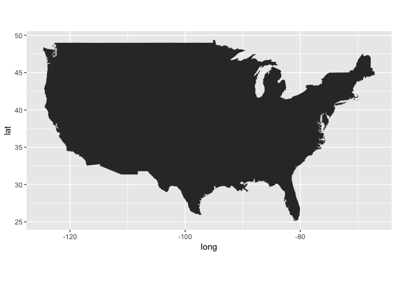
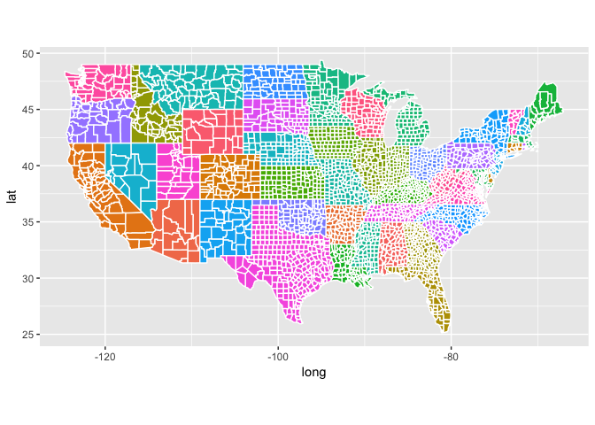
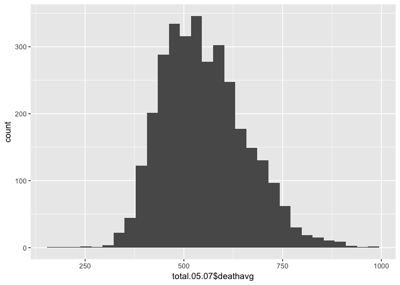
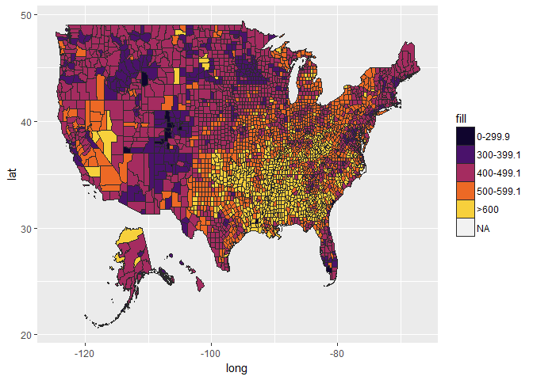
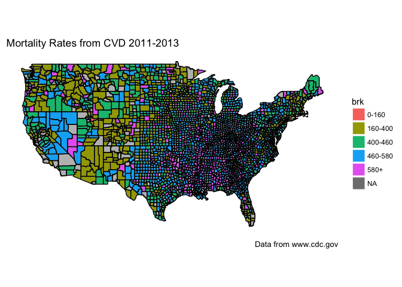

# Introduction

Heart disease is the leading cause of death in the USA, accounting for approximately 1 in every 4 deaths (@ref). **I will write more about introduction and include some figures in the next few days**.

## Prerequisites

To perform these maps, you will need to have several extra packages. I'm not going into how to install them, but a quick google search should tell you how to. The main libraries that we will need are:

1. [tidyverse](https://www.tidyverse.org/): this is a package created by Hadley Wickham. This "umbrella" package was designed to make data science analysis and visualition faster and easier. The main packages that we will use in this analysis are:
    + [dplyr](http://dplyr.tidyverse.org/): grammar of data manipulation, i.e. how to import, select, filter, and arrange your data for analysis;
    + [ggplot2](http://ggplot2.tidyverse.org/): system for declaratively creating graphics, i.e. you provide the data, tell it how to map, and it takes care of details;
    + [stringr](http://stringr.tidyverse.org/): provides a set of functions designed to make working with strings as easy as possible.
2. [maps](https://cran.r-project.org/web/packages/maps/README.html): package for displaying maps;
3. [mapdata](https://www.rdocumentation.org/packages/mapdata/versions/2.2-6): supplements the `maps` package, providing some larger and/or higher-resolution databases.
4. [ggmap](https://github.com/dkahle/ggmap): package to retrieve [raster map tiles](https://en.wikipedia.org/wiki/Tiled_web_map) (map displayed by joining dozens of individually requested image files over the internet) from popular online mapping service like Google Maps, and others.

## Load the libraries

```r
library(ggplot2)
library(ggmap)
library(maps)
library(mapdata)
library(dplyr)
```

```
## 
## Attaching package: 'dplyr'
```

```
## The following objects are masked from 'package:stats':
## 
##     filter, lag
```

```
## The following objects are masked from 'package:base':
## 
##     intersect, setdiff, setequal, union
```

```r
library(stringr)
```

## Plotting the maps

Although the `maps` package is able to plot, we will use `ggplot2` to actually plot. For that, we will need to do some transformations in the data since `ggplot2` operates on data frames.


```r
usa <- map_data("usa")
dim(usa)
```

```
## [1] 7243    6
```

```r
head(usa)
```

```
##        long      lat group order region subregion
## 1 -101.4078 29.74224     1     1   main      <NA>
## 2 -101.3906 29.74224     1     2   main      <NA>
## 3 -101.3620 29.65056     1     3   main      <NA>
## 4 -101.3505 29.63911     1     4   main      <NA>
## 5 -101.3219 29.63338     1     5   main      <NA>
## 6 -101.3047 29.64484     1     6   main      <NA>
```

```r
tail(usa)
```

```
##           long      lat group order         region subregion
## 7247 -122.6187 48.37482    10  7247 whidbey island      <NA>
## 7248 -122.6359 48.35764    10  7248 whidbey island      <NA>
## 7249 -122.6703 48.31180    10  7249 whidbey island      <NA>
## 7250 -122.7218 48.23732    10  7250 whidbey island      <NA>
## 7251 -122.7104 48.21440    10  7251 whidbey island      <NA>
## 7252 -122.6703 48.17429    10  7252 whidbey island      <NA>
```

```r
# Just as an exercise will plot the USA map to define one parameter
ggplot() + geom_polygon(data=usa, aes(x=long, y=lat, group=group)) +
  coord_fixed(1.3)
```

<!-- -->

That turned out pretty nice. The `coord_fixed()` function is very important when drawing maps. It "forces" a specific ration between the x and y axis. In our example, I asked for each *y* unit to be 1.3*x* unit. Why this is important? Because if we decide to change the size of file that we are saving, it knows the ratios and it will change accordingly, instead of potentially altering the ratios that we will use.

## Plot the county map

Now that we have a few things defined, lets plot the map with the counties just to see how it looks.


```r
counties <- map_data("county")
dim(counties)
```

```
## [1] 87949     6
```

```r
head(counties)
```

```
##        long      lat group order  region subregion
## 1 -86.50517 32.34920     1     1 alabama   autauga
## 2 -86.53382 32.35493     1     2 alabama   autauga
## 3 -86.54527 32.36639     1     3 alabama   autauga
## 4 -86.55673 32.37785     1     4 alabama   autauga
## 5 -86.57966 32.38357     1     5 alabama   autauga
## 6 -86.59111 32.37785     1     6 alabama   autauga
```

```r
tail(counties)
```

```
##            long      lat group order   region  subregion
## 91028 -104.9659 40.00964  3085 91028 colorado broomfield
## 91029 -104.9659 40.00964  3085 91029 colorado broomfield
## 91030 -104.9831 40.00964  3085 91030 colorado broomfield
## 91031 -105.0575 39.91224  3085 91031 colorado broomfield
## 91032 -105.1492 39.90078  3085 91032 colorado broomfield
## 91033 -105.1721 39.91224  3085 91033 colorado broomfield
```

```r
# Just as an exercise will plot the USA map to define one parameter
ggplot() + geom_polygon(data=counties, aes(x=long, y=lat, fill=region, group=group), color="white") +
  coord_fixed(1.3) +
  guides(fill=FALSE)
```

<!-- -->

Now, we have the basic shape that we will use to create our maps.

## Getting data about counties

Data was obtained from the [CDC](https://www.cdc.gov/). For this first analysis, I downloaded the data for **Deaths - Total Cardiovascular Disease** for both genders, 35+ year old individuals, from 2005 to 2015 (two year increment, 2005-2007, 2007-2009, etc). The files also have risk factors associated with CVD, such as **Obesity**, **Diabete**, and **Exercise**.


```r
#r stands for raw right now
r.total.05.07 <- as.data.frame(read.csv("data/2005-2007cdc-report-heart-disease-and-risk-factors.csv", header=TRUE))
r.total.07.09 <- as.data.frame(read.csv("data/2007-2009-cdc-report-heart-disease-and-risk-factors.csv", header=TRUE))
r.total.09.11 <- as.data.frame(read.csv("data/2009-2011-cdc-report-heart-disease-and-risk-factors.csv", header=TRUE))
r.total.11.13 <- as.data.frame(read.csv("data/2011-2013-cdc-report-heart-disease-and-risk-factors.csv", header=TRUE))
r.total.13.15 <- as.data.frame(read.csv("data/2013-2015-cdc-report-heart-disease-and-risk-factors.csv"))
#Check to see how the Counties are label in datasets so we can start working on them
head(counties)
```

```
##        long      lat group order  region subregion
## 1 -86.50517 32.34920     1     1 alabama   autauga
## 2 -86.53382 32.35493     1     2 alabama   autauga
## 3 -86.54527 32.36639     1     3 alabama   autauga
## 4 -86.55673 32.37785     1     4 alabama   autauga
## 5 -86.57966 32.38357     1     5 alabama   autauga
## 6 -86.59111 32.37785     1     6 alabama   autauga
```

```r
head(r.total.05.07)
```

```
##   cnty_fips    display_name Value         theme_range dm_prev_adj
## 1      1001 "Autauga, (AL)" 734.7 639.7 - 989.4 (643)        11.4
## 2      1003 "Baldwin, (AL)" 586.7 571.5 - 639.6 (642)         9.3
## 3      1005 "Barbour, (AL)" 691.3 639.7 - 989.4 (643)        16.5
## 4      1007    "Bibb, (AL)" 704.3 639.7 - 989.4 (643)        13.5
## 5      1009  "Blount, (AL)" 668.5 639.7 - 989.4 (643)        12.5
## 6      1011 "Bullock, (AL)" 788.0 639.7 - 989.4 (643)        18.0
##   ob_prev_adj ltpia_prev_adj
## 1        36.3           30.3
## 2        29.4           23.5
## 3        44.5           29.9
## 4        38.5           36.7
## 5        36.1           28.0
## 6        40.1           29.3
```

So, there are several things that we need to change. First, we need to change column names from `display_name` to `subregion`. Second, we need to remove `, (state)` from the *county* name. Third, we need to make the *county* name to be all lower case.

I will start with the `05-07` dataset first, to do trial and error. After that, I will repeat for the other years. 


```r
# Gonna do the 05-07 first to see how it goes. After that do the rest
r.total.05.07$subregion <- str_extract(r.total.05.07$display_name, 
                                     '[a-zA-Z]+') %>%
                         tolower()
r.total.05.07$deathavg <- replace(r.total.05.07$Value, r.total.05.07$Value<0, NA)
r.total.05.07$diabetes <- replace(r.total.05.07$dm_prev_adj, r.total.05.07$dm_prev_adj<0, NA)
r.total.05.07$obesity <- replace(r.total.05.07$ob_prev_adj, r.total.05.07$ob_prev_adj<0, NA)
r.total.05.07$exercise <- replace(r.total.05.07$ltpia_prev_adj, r.total.05.07$ltpia_prev_adj<0, NA)

total.05.07 <- select(r.total.05.07, subregion, 
                      deathavg,diabetes, 
                      ob_prev_adj,exercise) %>%
                      as.data.frame(stringAsFactors=FALSE)
head(total.05.07)
```

```
##   subregion deathavg diabetes ob_prev_adj exercise
## 1   autauga    734.7     11.4        36.3     30.3
## 2   baldwin    586.7      9.3        29.4     23.5
## 3   barbour    691.3     16.5        44.5     29.9
## 4      bibb    704.3     13.5        38.5     36.7
## 5    blount    668.5     12.5        36.1     28.0
## 6   bullock    788.0     18.0        40.1     29.3
```

```r
head(counties)
```

```
##        long      lat group order  region subregion
## 1 -86.50517 32.34920     1     1 alabama   autauga
## 2 -86.53382 32.35493     1     2 alabama   autauga
## 3 -86.54527 32.36639     1     3 alabama   autauga
## 4 -86.55673 32.37785     1     4 alabama   autauga
## 5 -86.57966 32.38357     1     5 alabama   autauga
## 6 -86.59111 32.37785     1     6 alabama   autauga
```

That looks promising. We now have the numbers that we want, all we need is to join the tables together.


```r
#we can also remove the raw 05-07 dataset to "clear" our environment as well
rm(r.total.05.07)
counties0507 <- inner_join(counties, total.05.07, by="subregion")
head(counties0507)
```

```
##        long      lat group order  region subregion deathavg diabetes
## 1 -86.50517 32.34920     1     1 alabama   autauga    734.7     11.4
## 2 -86.53382 32.35493     1     2 alabama   autauga    734.7     11.4
## 3 -86.54527 32.36639     1     3 alabama   autauga    734.7     11.4
## 4 -86.55673 32.37785     1     4 alabama   autauga    734.7     11.4
## 5 -86.57966 32.38357     1     5 alabama   autauga    734.7     11.4
## 6 -86.59111 32.37785     1     6 alabama   autauga    734.7     11.4
##   ob_prev_adj exercise
## 1        36.3     30.3
## 2        36.3     30.3
## 3        36.3     30.3
## 4        36.3     30.3
## 5        36.3     30.3
## 6        36.3     30.3
```

```r
counties0507$brk <- cut(counties0507$deathavg, 
                      breaks=c(0, 160, 400, 460, 580, 1000000), 
                      labels=c("0-160", "160-400", "400-460", "460-580", "580+"),
                      include.lowest=TRUE)
```

```r
qplot(total.05.07$deathavg, geom="histogram")
```

```
## `stat_bin()` using `bins = 30`. Pick better value with `binwidth`.
```

```
## Warning: Removed 10 rows containing non-finite values (stat_bin).
```

<!-- -->


Ok, now we are finally ready to plot the mortality rates


```r
ditch_the_axes <- theme(
  axis.text = element_blank(),
  axis.line = element_blank(),
  axis.ticks = element_blank(),
  panel.border = element_blank(),
  panel.grid = element_blank(),
  axis.title = element_blank()
  )


counties_base <- ggplot(data = counties, mapping = 
                          aes(x = long, y = lat, group = group)) + 
                        coord_fixed(1.3) + 
                        geom_polygon(color = "black", fill = "gray")
counties_base
```

<!-- -->

```r
testing0507 <- counties_base + 
      geom_polygon(data = counties0507, aes(fill = brk), color="white")+
      geom_polygon(color = "black", fill = NA) +
      theme_bw() +
      ditch_the_axes +
      labs(title = "Mortality Rates from CVD 2005-2007", 
           caption = "Data from www.cdc.gov")
testing0507
```

<!-- -->


```r
# 2007-2009 done
r.total.07.09$subregion <- str_extract(r.total.07.09$display_name, 
                                     '[a-zA-Z]+') %>%
                         tolower()
r.total.07.09$deathavg <- replace(r.total.07.09$Value, r.total.07.09$Value<0, NA)
r.total.07.09$diabetes <- replace(r.total.07.09$dm_prev_adj, r.total.07.09$dm_prev_adj<0, NA)
r.total.07.09$obesity <- replace(r.total.07.09$ob_prev_adj, r.total.07.09$ob_prev_adj<0, NA)
r.total.07.09$exercise <- replace(r.total.07.09$ltpia_prev_adj, r.total.07.09$ltpia_prev_adj<0, NA)

total.07.09 <- select(r.total.07.09, subregion, 
                      deathavg,diabetes, 
                      ob_prev_adj,exercise) %>%
                      as.data.frame(stringAsFactors=FALSE)
head(total.07.09)
```

```
##   subregion deathavg diabetes ob_prev_adj exercise
## 1   autauga    631.3     11.4        36.3     30.3
## 2   baldwin    531.8      9.3        29.4     23.5
## 3   barbour    638.0     16.5        44.5     29.9
## 4      bibb    645.9     13.5        38.5     36.7
## 5    blount    619.9     12.5        36.1     28.0
## 6   bullock    666.7     18.0        40.1     29.3
```

```r
head(counties)
```

```
##        long      lat group order  region subregion
## 1 -86.50517 32.34920     1     1 alabama   autauga
## 2 -86.53382 32.35493     1     2 alabama   autauga
## 3 -86.54527 32.36639     1     3 alabama   autauga
## 4 -86.55673 32.37785     1     4 alabama   autauga
## 5 -86.57966 32.38357     1     5 alabama   autauga
## 6 -86.59111 32.37785     1     6 alabama   autauga
```

```r
rm(r.total.07.09)
counties0709 <- inner_join(counties, total.07.09, by="subregion")
head(counties0709)
```

```
##        long      lat group order  region subregion deathavg diabetes
## 1 -86.50517 32.34920     1     1 alabama   autauga    631.3     11.4
## 2 -86.53382 32.35493     1     2 alabama   autauga    631.3     11.4
## 3 -86.54527 32.36639     1     3 alabama   autauga    631.3     11.4
## 4 -86.55673 32.37785     1     4 alabama   autauga    631.3     11.4
## 5 -86.57966 32.38357     1     5 alabama   autauga    631.3     11.4
## 6 -86.59111 32.37785     1     6 alabama   autauga    631.3     11.4
##   ob_prev_adj exercise
## 1        36.3     30.3
## 2        36.3     30.3
## 3        36.3     30.3
## 4        36.3     30.3
## 5        36.3     30.3
## 6        36.3     30.3
```

```r
counties0709$brk <- cut(counties0709$deathavg, 
                      breaks=c(0, 160, 400, 460, 580, 1000000), 
                      labels=c("0-160", "160-400", "400-460", "460-580", "580+"),
                      include.lowest=TRUE)
```


```r
testing0709 <- counties_base + 
      geom_polygon(data = counties0709, aes(fill = brk), color="white")+
      geom_polygon(color = "black", fill = NA) +
      theme_bw() +
      ditch_the_axes +
      labs(title = "Mortality Rates from CVD 2007-2009", 
           caption = "Data from www.cdc.gov")
testing0709
```

<!-- -->


```r
# 2009-2011 done
r.total.09.11$subregion <- str_extract(r.total.09.11$display_name, 
                                     '[a-zA-Z]+') %>%
                         tolower()
r.total.09.11$deathavg <- replace(r.total.09.11$Value, r.total.09.11$Value<0, NA)
r.total.09.11$diabetes <- replace(r.total.09.11$dm_prev_adj, r.total.09.11$dm_prev_adj<0, NA)
r.total.09.11$obesity <- replace(r.total.09.11$ob_prev_adj, r.total.09.11$ob_prev_adj<0, NA)
r.total.09.11$exercise <- replace(r.total.09.11$ltpia_prev_adj, r.total.09.11$ltpia_prev_adj<0, NA)

total.09.11 <- select(r.total.09.11, subregion, 
                      deathavg,diabetes, 
                      ob_prev_adj,exercise) %>%
                      as.data.frame(stringAsFactors=FALSE)
head(total.09.11)
```

```
##   subregion deathavg diabetes ob_prev_adj exercise
## 1   autauga    617.0     11.4        36.3     30.3
## 2   baldwin    536.7      9.3        29.4     23.5
## 3   barbour    721.8     16.5        44.5     29.9
## 4      bibb    650.7     13.5        38.5     36.7
## 5    blount    582.1     12.5        36.1     28.0
## 6   bullock    670.4     18.0        40.1     29.3
```

```r
head(counties)
```

```
##        long      lat group order  region subregion
## 1 -86.50517 32.34920     1     1 alabama   autauga
## 2 -86.53382 32.35493     1     2 alabama   autauga
## 3 -86.54527 32.36639     1     3 alabama   autauga
## 4 -86.55673 32.37785     1     4 alabama   autauga
## 5 -86.57966 32.38357     1     5 alabama   autauga
## 6 -86.59111 32.37785     1     6 alabama   autauga
```

```r
rm(r.total.09.11)
counties0911 <- inner_join(counties, total.09.11, by="subregion")
head(counties0911)
```

```
##        long      lat group order  region subregion deathavg diabetes
## 1 -86.50517 32.34920     1     1 alabama   autauga      617     11.4
## 2 -86.53382 32.35493     1     2 alabama   autauga      617     11.4
## 3 -86.54527 32.36639     1     3 alabama   autauga      617     11.4
## 4 -86.55673 32.37785     1     4 alabama   autauga      617     11.4
## 5 -86.57966 32.38357     1     5 alabama   autauga      617     11.4
## 6 -86.59111 32.37785     1     6 alabama   autauga      617     11.4
##   ob_prev_adj exercise
## 1        36.3     30.3
## 2        36.3     30.3
## 3        36.3     30.3
## 4        36.3     30.3
## 5        36.3     30.3
## 6        36.3     30.3
```

```r
counties0911$brk <- cut(counties0911$deathavg, 
                      breaks=c(0, 160, 400, 460, 580, 1000000), 
                      labels=c("0-160", "160-400", "400-460", "460-580", "580+"),
                      include.lowest=TRUE)
```


```r
testing0911 <- counties_base + 
      geom_polygon(data = counties0911, aes(fill = brk), color="white")+
      geom_polygon(color = "black", fill = NA) +
      theme_bw() +
      ditch_the_axes +
      labs(title = "Mortality Rates from CVD 2009-2011", 
           caption = "Data from www.cdc.gov")
testing0911
```

<!-- -->


```r
# 2011-2013 done
r.total.11.13$subregion <- str_extract(r.total.11.13$display_name, 
                                     '[a-zA-Z]+') %>%
                         tolower()
r.total.11.13$deathavg <- replace(r.total.11.13$Value, r.total.11.13$Value<0, NA)
r.total.11.13$diabetes <- replace(r.total.11.13$dm_prev_adj, r.total.11.13$dm_prev_adj<0, NA)
r.total.11.13$obesity <- replace(r.total.11.13$ob_prev_adj, r.total.11.13$ob_prev_adj<0, NA)
r.total.11.13$exercise <- replace(r.total.11.13$ltpia_prev_adj, r.total.11.13$ltpia_prev_adj<0, NA)

total.11.13 <- select(r.total.11.13, subregion, 
                      deathavg,diabetes, 
                      ob_prev_adj,exercise) %>%
                      as.data.frame(stringAsFactors=FALSE)
head(total.11.13)
```

```
##   subregion deathavg diabetes ob_prev_adj exercise
## 1   autauga    625.6     11.4        36.3     30.3
## 2   baldwin    512.3      9.3        29.4     23.5
## 3   barbour    642.1     16.5        44.5     29.9
## 4      bibb    686.3     13.5        38.5     36.7
## 5    blount    521.6     12.5        36.1     28.0
## 6   bullock    598.3     18.0        40.1     29.3
```

```r
head(counties)
```

```
##        long      lat group order  region subregion
## 1 -86.50517 32.34920     1     1 alabama   autauga
## 2 -86.53382 32.35493     1     2 alabama   autauga
## 3 -86.54527 32.36639     1     3 alabama   autauga
## 4 -86.55673 32.37785     1     4 alabama   autauga
## 5 -86.57966 32.38357     1     5 alabama   autauga
## 6 -86.59111 32.37785     1     6 alabama   autauga
```

```r
rm(r.total.11.13)
counties1113 <- inner_join(counties, total.11.13, by="subregion")
head(counties1113)
```

```
##        long      lat group order  region subregion deathavg diabetes
## 1 -86.50517 32.34920     1     1 alabama   autauga    625.6     11.4
## 2 -86.53382 32.35493     1     2 alabama   autauga    625.6     11.4
## 3 -86.54527 32.36639     1     3 alabama   autauga    625.6     11.4
## 4 -86.55673 32.37785     1     4 alabama   autauga    625.6     11.4
## 5 -86.57966 32.38357     1     5 alabama   autauga    625.6     11.4
## 6 -86.59111 32.37785     1     6 alabama   autauga    625.6     11.4
##   ob_prev_adj exercise
## 1        36.3     30.3
## 2        36.3     30.3
## 3        36.3     30.3
## 4        36.3     30.3
## 5        36.3     30.3
## 6        36.3     30.3
```

```r
counties1113$brk <- cut(counties1113$deathavg, 
                      breaks=c(0, 160, 400, 460, 580, 1000000), 
                      labels=c("0-160", "160-400", "400-460", "460-580", "580+"),
                      include.lowest=TRUE)
```


```r
testing1113 <- counties_base + 
      geom_polygon(data = counties1113, aes(fill = brk), color="white")+
      geom_polygon(color = "black", fill = NA) +
      theme_bw() +
      ditch_the_axes +
      labs(title = "Mortality Rates from CVD 2011-2013", 
           caption = "Data from www.cdc.gov")
testing1113
```

<!-- -->


```r
# 2013-2015 done
r.total.13.15$subregion <- str_extract(r.total.13.15$display_name, 
                                     '[a-zA-Z]+') %>%
                         tolower()
r.total.13.15$deathavg <- replace(r.total.13.15$Value, r.total.13.15$Value<0, NA)
r.total.13.15$diabetes <- replace(r.total.13.15$dm_prev_adj, r.total.13.15$dm_prev_adj<0, NA)
r.total.13.15$obesity <- replace(r.total.13.15$ob_prev_adj, r.total.13.15$ob_prev_adj<0, NA)
r.total.13.15$exercise <- replace(r.total.13.15$ltpia_prev_adj, r.total.13.15$ltpia_prev_adj<0, NA)

total.13.15 <- select(r.total.13.15, subregion, 
                      deathavg,diabetes, 
                      ob_prev_adj,exercise) %>%
                      as.data.frame(stringAsFactors=FALSE)
head(total.13.15)
```

```
##   subregion deathavg diabetes ob_prev_adj exercise
## 1   autauga    568.0     11.4        36.3     30.3
## 2   baldwin    489.0      9.3        29.4     23.5
## 3   barbour    598.6     16.5        44.5     29.9
## 4      bibb    597.8     13.5        38.5     36.7
## 5    blount    511.4     12.5        36.1     28.0
## 6   bullock    562.0     18.0        40.1     29.3
```

```r
head(counties)
```

```
##        long      lat group order  region subregion
## 1 -86.50517 32.34920     1     1 alabama   autauga
## 2 -86.53382 32.35493     1     2 alabama   autauga
## 3 -86.54527 32.36639     1     3 alabama   autauga
## 4 -86.55673 32.37785     1     4 alabama   autauga
## 5 -86.57966 32.38357     1     5 alabama   autauga
## 6 -86.59111 32.37785     1     6 alabama   autauga
```

```r
rm(r.total.13.15)
counties1315 <- inner_join(counties, total.13.15, by="subregion")
head(counties1315)
```

```
##        long      lat group order  region subregion deathavg diabetes
## 1 -86.50517 32.34920     1     1 alabama   autauga      568     11.4
## 2 -86.53382 32.35493     1     2 alabama   autauga      568     11.4
## 3 -86.54527 32.36639     1     3 alabama   autauga      568     11.4
## 4 -86.55673 32.37785     1     4 alabama   autauga      568     11.4
## 5 -86.57966 32.38357     1     5 alabama   autauga      568     11.4
## 6 -86.59111 32.37785     1     6 alabama   autauga      568     11.4
##   ob_prev_adj exercise
## 1        36.3     30.3
## 2        36.3     30.3
## 3        36.3     30.3
## 4        36.3     30.3
## 5        36.3     30.3
## 6        36.3     30.3
```

```r
counties1315$brk <- cut(counties1315$deathavg, 
                      breaks=c(0, 160, 400, 460, 580, 1000000), 
                      labels=c("0-160", "160-400", "400-460", "460-580", "580+"),
                      include.lowest=TRUE)
```


```r
testing1315 <- counties_base + 
      geom_polygon(data = counties1315, aes(fill = brk), color="white")+
      geom_polygon(color = "black", fill = NA) +
      theme_bw() +
      ditch_the_axes +
      labs(title = "Mortality Rates from CVD 2013-2015", 
           caption = "Data from www.cdc.gov")
testing1315
```

<!-- -->
